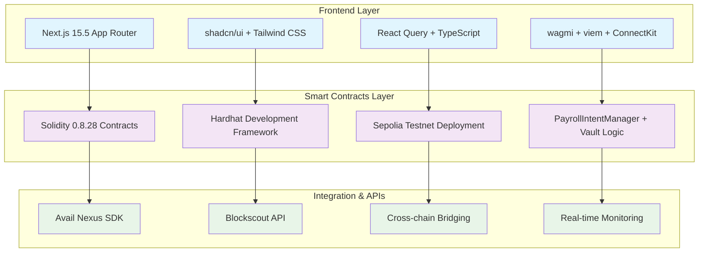

# Synced Streams

> 🚀 **Cross-chain payroll automation powered by Avail Nexus SDK**

Synced Streams is a production-ready full-stack application that enables crypto-native organizations to run automated PYUSD/USDC payroll across multiple blockchain networks. The project combines a conversion-focused landing page with a real-time operator dashboard that streams live Sepolia intent data from the Avail SDK automation stack.

[](https://opensource.org/licenses/MIT)
[](https://nextjs.org/)
[](https://www.typescriptlang.org/)
[](https://soliditylang.org/)

## 🎯 Problem We're Solving

Treasury and operations teams struggle with cross-chain payroll execution because:

- **🔧 Fragmented tooling** forces finance leads to juggle spreadsheets, bridges, and bots
- **👁️ Limited visibility** makes it impossible to prove when and how each worker was paid  
- **⚠️ Manual execution risk** increases exponentially as teams expand across chains and tokens
- **📊 Compliance nightmares** when tracking payments across multiple blockchain networks

## ✨ Our Solution

We provide a **single unified interface** that both markets the product to decision makers while giving operators complete control:

- **🎨 Conversion-focused landing page** that articulates value, differentiators, and clear calls-to-action
- **📊 Live operator dashboard** with real-time treasury balances, scheduled releases, and historical automation events
- **🤖 Role-aware automation** leveraging the Avail Nexus SDK to execute intents and enforce governance
- **🔍 Complete transparency** through Blockscout integration for audit trails and compliance

## 🏗️ Architecture Overview



### 📁 Project Structure

```
ethg-2025/
├── frontend/                    # Next.js web application
│   ├── src/
│   │   ├── app/                # App Router pages
│   │   │   ├── page.tsx        # Landing page
│   │   │   └── dashboard/      # Operator dashboard
│   │   ├── components/         # Reusable UI components
│   │   │   ├── ui/            # shadcn/ui components
│   │   │   └── blocks/        # Feature-specific components
│   │   └── providers/         # React context providers
│   ├── package.json
│   └── tailwind.config.js
├── smart-contracts/            # Blockchain contracts
│   └── v1/
│       ├── contracts/         # Solidity contract sources
│       ├── scripts/           # Deployment and utility scripts
│       ├── test/             # Contract test suites
│       └── hardhat.config.ts
└── README.md
```

## 🛠️ Tech Stack

### Frontend Technologies
- **Framework**: Next.js 15.5 with App Router
- **Styling**: Tailwind CSS 4.0 + shadcn/ui components
- **Language**: TypeScript 5.x
- **State Management**: React Query (TanStack Query)
- **Web3 Integration**: wagmi + viem for Ethereum interactions
- **Wallet Connection**: ConnectKit for seamless wallet integration
- **UI Components**: Radix UI primitives with custom styling
- **Icons**: Lucide React icon library

### Blockchain & Smart Contracts
- **Language**: Solidity 0.8.28
- **Development Framework**: Hardhat
- **Testing Framework**: Hardhat + Viem
- **Target Network**: Sepolia Testnet
- **Contract Libraries**: OpenZeppelin, Chainlink CCIP

### Integration & APIs
- **Avail Nexus SDK**: Cross-chain automation and intent execution
- **Blockscout API**: Real-time transaction tracking and verification
- **Upstash Redis**: Caching and session management
- **OpenAI**: AI-powered features and analytics

## 📋 Contract Addresses

### Sepolia Testnet Contracts

| Contract | Address | Etherscan |
|----------|---------|-----------|
| **PYUSD Token** | `0xCaC524BcA292aaade2DF8A05cC58F0a65B1B3bB9` | [View on Etherscan](https://sepolia.etherscan.io/address/0xCaC524BcA292aaade2DF8A05cC58F0a65B1B3bB9) |
| **PYUSD Treasury** | `0x2d060B36eDFC69435c083f06B5D82c5e6d84E1f8` | [View on Etherscan](https://sepolia.etherscan.io/address/0x2d060B36eDFC69435c083f06B5D82c5e6d84E1f8) |
| **PYUSD Payroll** | `0xaC1B68cC4Fd293ae675f34e83A8016cC5876A4c0` | [View on Etherscan](https://sepolia.etherscan.io/address/0xaC1B68cC4Fd293ae675f34e83A8016cC5876A4c0) |
| **USDC Treasury** | `0x35ECB24e1A117d2eaD8E66bD7D21E431aB645C4C` | [View on Etherscan](https://sepolia.etherscan.io/address/0x35ECB24e1A117d2eaD8E66bD7D21E431aB645C4C) |
| **USDC Payroll** | `0x280A2E9790D1d036870c1B563CF05bC07d55fA7E` | [View on Etherscan](https://sepolia.etherscan.io/address/0x280A2E9790D1d036870c1B563CF05bC07d55fA7E) |

### Useful Addresses

| Purpose | Address | Etherscan |
|---------|---------|-----------|
| **PYUSD Holder** (for testing) | `0xF9b2eFCAcc1B93c1bd7F898d0a8c4b34aBD78E53` | [View on Etherscan](https://sepolia.etherscan.io/address/0xF9b2eFCAcc1B93c1bd7F898d0a8c4b34aBD78E53) |
| **Test Grantee** | `0x9261432cab3c0F83E86fa6e41E4a88dA06E7ecc6` | [View on Etherscan](https://sepolia.etherscan.io/address/0x9261432cab3c0F83E86fa6e41E4a88dA06E7ecc6) |

> 💡 **Note**: Copy these addresses to your `.env.local` file. The `.env.example` file uses placeholder addresses for security.

## 🚀 Quick Start

### Prerequisites

Ensure you have the following installed:
- **Node.js** 20+ 
- **pnpm** 9+ (recommended) or npm/yarn
- **Git** for version control

### Environment Configuration

Create `frontend/.env.local` with your configuration:

```bash
# Blockchain Configuration
NEXT_PUBLIC_TREASURY_ADDRESS=0x...     # Your treasury contract address
NEXT_PUBLIC_PAYROLL_ADDRESS=0x...      # Payroll manager contract address  
NEXT_PUBLIC_PYUSD_ADDRESS=0x...        # PYUSD token contract address
NEXT_PUBLIC_WALLETCONNECT_PROJECT_ID=... # WalletConnect project ID

# API Keys (optional)
SEPOLIA_RPC_URL=https://sepolia.infura.io/v3/...
SEPOLIA_PRIVATE_KEY=your_private_key_here
```

### Installation & Development

1. **Clone and setup the frontend**:
```bash
cd frontend
pnpm install
pnpm dev
```

2. **Deploy smart contracts** (optional for development):
```bash
cd smart-contracts/v1
pnpm install
pnpm hardhat test
pnpm hardhat ignition deploy --network sepolia ignition/modules/PayrollIntentManager.ts
```

3. **Access the application**:
- 🌐 **Landing Page**: `http://localhost:3000`
- 📊 **Operator Dashboard**: `http://localhost:3000/dashboard`

## 📋 Available Scripts

### Frontend Commands
```bash
pnpm dev          # Start development server
pnpm build        # Build for production
pnpm start        # Start production server
pnpm lint         # Run ESLint
```

### Smart Contract Commands  
```bash
pnpm hardhat test           # Run contract tests
pnpm hardhat compile        # Compile contracts
pnpm hardhat node          # Start local Hardhat network
pnpm hardhat ignition deploy # Deploy contracts
```

## 🔧 Key Features

### 🎯 Landing Page
- **Interactive cross-chain route visualization** with animated transfer flows
- **Real-time statistics** showcasing platform capabilities
- **Conversion-focused design** with clear CTAs and value propositions
- **Responsive layout** optimized for all device sizes

### 📊 Operator Dashboard  
- **Live treasury monitoring** across multiple chains
- **Intent scheduling** with time-locked automation
- **Real-time execution tracking** via Blockscout integration
- **Historical audit logs** for compliance and reporting
- **Multi-chain support** for Sepolia, Base, Arbitrum, and Optimism

### 🔗 Blockchain Integration
- **Cross-chain bridging** via Avail Nexus SDK
- **Smart contract automation** with gas-optimized execution
- **Event-driven architecture** for real-time updates
- **Secure wallet integration** with multiple provider support

## 🗺️ Development Roadmap

- [ ] **Real-time execution monitoring** - Wire Avail Nexus actions back to dashboard
- [ ] **Multi-token support** - Extend beyond PYUSD to other stablecoins  
- [ ] **Compliance exports** - Region-specific reporting and audit trails
- [ ] **Multi-sig integration** - Enhanced treasury governance controls
- [ ] **Mainnet deployment** - Production-ready network configuration
- [ ] **Mobile optimization** - Native mobile app experience

## 🤝 Contributing

We welcome contributions! Please see our [Contributing Guide](CONTRIBUTING.md) for details.

1. Fork the repository
2. Create your feature branch (`git checkout -b feature/amazing-feature`)
3. Commit your changes (`git commit -m 'Add amazing feature'`)
4. Push to the branch (`git push origin feature/amazing-feature`)
5. Open a Pull Request

## 📄 License

This project is licensed under the MIT License - see the [LICENSE](LICENSE) file for details.

## 🔗 Links & Resources

- **📚 Documentation**: [Avail Project Docs](https://docs.availproject.org)
- **🐦 Twitter**: [@godlovesu_n](https://x.com/godlovesu_n)  
- **💻 GitHub**: [N-45div](https://github.com/N-45div)
- **📧 Contact**: [hello@availproject.org](mailto:hello@availproject.org)

---

**Built with ❤️ by the Avail Nexus team**
